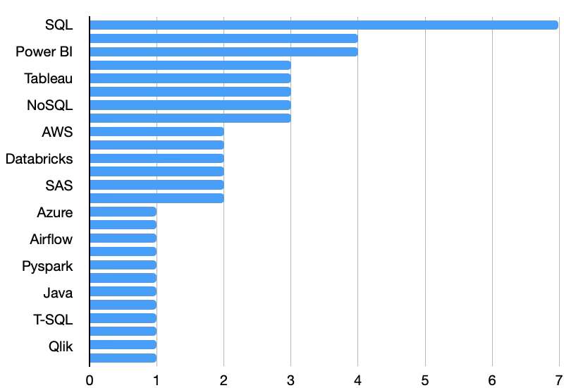
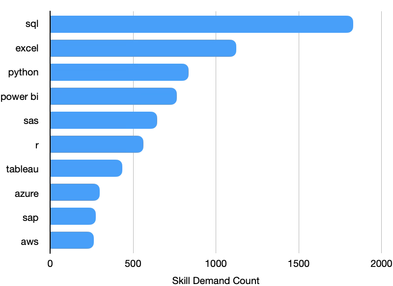
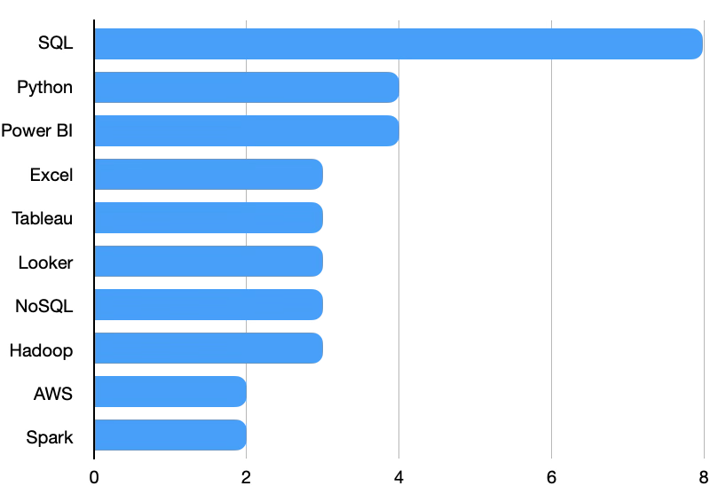

# Introduction
Take a dive into the data job market, focusing on analyst roles in South Africa or remote working roles. This project explores top-paying jobs, in-demand skills and where high demand meets high salaries in data analytics. 

SQL queries? Check them out here: [project_sql folder](/project_sql/)

# Background
This project navigates the analyst job market, pin-pointing top-paying and in-demand skills, aimed at streamlining the search for which skills to develop for analyst jobs primarily in the South African market. 

Data Hails from Luke Barousse's [SQL Course](https://www.lukebarousse.com/sql). It has insights on ob titles, salaries, locations, and core skills. 

### The questions I wanted to answer through my SQL queries were:

1. What are the top-paying analyst jobs in South Africa and what industries are these jobs in?

2. What skills are required for these top-paying jobs?

3. What are the most in-demand skills for analysts in the South African job market?

4. What skills are associated with higher salaries in South Africa?

5. What are the optimal skills to learn as an aspiring analyst in the South African job market?

# Tools I Used
For this deep dive into the analyst job market, I used several key tools:

- SQL: Forms the backbone of my analysis, allowing me to query the database and unearth key inisights.
- PostgreSQL: The chosen database management system, ideal for handling the job posting data.
- Visual Studio Code: My programme of choice for database management and executing SQL queries. 
- Git & GitHub: Essential tools for version control and sharing my SQL scripts and analysis, ensuring collaboration and project tracking. 
- OpenAI's ChatGPT and Google Gemini: Used to interpret data and summarise query data. 

# The Analysis
### 1. Top Paying Analyst Jobs
To identify the highest-paying analyst roles, I filtered the analyst positions by average annual salary and location, focusing on jobs in South Africa. This query highlights the high-paying opportunities in the analyst field. 

```sql
SELECT
    job_id,
    job_title,
    job_location,
    job_schedule_type,
    salary_year_avg,
    job_posted_date,
    c.name AS company_name
FROM
    job_postings_fact AS j
LEFT JOIN company_dim AS c ON j.company_id = c.company_id
WHERE
    job_title_short ILIKE '%Analyst%' AND
    job_location ILIKE '%South Africa%' AND
    salary_year_avg IS NOT NULL
ORDER BY
    salary_year_avg DESC
LIMIT 10;
``` 
Here are some insights into the Top Paying Analyst Jobs in South Africa:
1. Data Architecture offers the highest earning potential — The Data Architect role at Luno leads the results at $165,000/year, showing the premium placed on advanced data expertise.

2. Specialised and senior analyst roles pay more — BI Analyst and Senior Data Analyst positions reach $111,175–$130,000, suggesting that seniority and specialisation significantly increase earning potential.

3. Financial services is a strong sector for analysts — Nedbank and Standard Bank feature prominently among the highest-paying roles, highlighting banking and insurance as attractive industries for data professionals.

4. Johannesburg has strong high-paying opportunities — Several of the highest-paying positions are based in Johannesburg, particularly in banking, data management and senior analytics.

5. Technical skills are key to reaching higher salaries — The results support the importance of SQL, Python and BI tools such as Power BI for progressing from general analyst positions into higher-paying specialised and senior roles.


*Bar graph visualising the salaries of the top paying analyst roles in South Africa*

### 2. Top Paying Analyst Job Skills

``` sql
WITH top_paying_jobs AS (
    SELECT
        job_id,
        name AS company_name,
        job_title,
        job_location,
        salary_year_avg
    FROM
        job_postings_fact AS j
    LEFT JOIN company_dim AS c ON j.company_id = c.company_id
    WHERE
        job_title_short ILIKE '%Analyst%' AND
        job_location ILIKE '%South Africa%' AND
        salary_year_avg IS NOT NULL
    ORDER BY
        salary_year_avg DESC
    LIMIT 10
)
SELECT
    tpj.*,
    skills
FROM top_paying_jobs AS tpj
INNER JOIN skills_job_dim AS sjd ON tpj.job_id = sjd.job_id
INNER JOIN skills_dim AS s ON sjd.skill_id = s.skill_id
ORDER BY
    salary_year_avg DESC
```
Here are some insights into the Top Paying Analyst Job skills in South Africa:
1. __SQL__ is the most consistently valuable skill among top-paying analyst roles. It appears across Nedbank, Impact, Ozow, Deloitte, Takealot, Standard Bank and Experian, making it the strongest common technical foundation.

2. High-paying analyst roles increasingly require a combination of analytics and advanced data technologies. __Python__, __NoSQL__, __Spark__, __Databricks__, __Hadoop__, __Kafka__ and cloud platforms such as __AWS__, __GCP__ and __Azure__ appear across the highest-paid positions.

3. BI and visualisation skills remain important even at senior levels. __Power BI__, __Tableau__ and __Looker__ feature in several $111,175 senior analyst roles, showing that the ability to turn data into business insights remains highly valued.

4. The highest-paying role requires data-engineering expertise. Luno's $165,000 Data Architect position requires __Databricks__, __AWS__ and __Spark__, highlighting the substantial earning potential of combining analytics with cloud and big-data technologies.

5. The strongest career skill combination is broad rather than relying on one tool. The data suggests that an analyst targeting the top end of the market should build a core of __SQL + Python + BI__, then add cloud/data-engineering technologies such as AWS/Azure, Spark and Databricks to progress toward senior and architect-level roles.


*Bar chart visualising the number of times skills show up in high-paying job postings for analysts in South Africa*

### 3. Top Demand Skills for Analyst Positions

``` sql
SELECT
    skills,
    COUNT(sjd.job_id) AS demand_count
FROM job_postings_fact AS j
INNER JOIN skills_job_dim AS sjd ON j.job_id = sjd.job_id
INNER JOIN skills_dim AS s ON sjd.skill_id = s.skill_id
WHERE
    job_title_short ILIKE '%Analyst%' AND
    job_location ILIKE '%South Africa%'
GROUP BY
skills
ORDER BY
demand_count DESC
LIMIT 10
```
Here are some insights into the skills most in demand for Analyst Jobs in South Africa:
1. __SQL__ is by far the most in-demand analyst skill, appearing in 1,828 postings—well ahead of Excel at 1,122. This makes SQL the strongest foundational skill for an analyst career.

2. __Excel__ remains highly relevant, with 1,122 postings. Despite the growth of modern analytics tools, traditional spreadsheet skills continue to be heavily requested by employers.

3. __Python and Power BI__ form a strong second tier. Python appears in 834 postings, while Power BI appears in 765, highlighting the importance of both programming and business intelligence skills.

4. __SAS__ and __R__ remain significant, with 644 and 562 postings, respectively. Their relatively high demand suggests that statistical programming remains particularly valuable in industries such as finance, insurance and research.

5. Cloud skills are emerging but less widespread. __Azure (297)__ and __AWS (263)__ have lower demand than core analytics tools, but their presence indicates that cloud knowledge can provide an advantage as analysts move toward more advanced data and analytics roles.

The data suggests that a strong skill combination for an analyst is __SQL + Excel + Python + Power BI__, with cloud skills like __AWS__ or __Azure__ providing opportunities to progress toward more technical, higher-paying roles. 


*Bar graph visualising the most in demand analyst skills in South Africa*

### 4. Top Paying Analyst Skills

``` sql
SELECT
    skills,
    ROUND(AVG(salary_year_avg),0) AS avg_salary,
    c.name AS company_name,
    j.job_title_short AS job_title
FROM job_postings_fact AS j
INNER JOIN skills_job_dim AS sjd ON j.job_id = sjd.job_id
INNER JOIN skills_dim AS s ON sjd.skill_id = s.skill_id
INNER JOIN company_dim AS c ON j.company_id = c.company_id
WHERE
    job_title_short ILIKE '%Analyst%' AND
    salary_year_avg IS NOT NULL AND 
    job_location ILIKE '%South Africa%'
GROUP BY
skills, c.name, j.job_title_short
ORDER BY
avg_salary DESC;
```
Here are some insights into what skills top earning analysts are expected to have:
1. __SQL__ is the dominant skill — It appears in 8 of the 10 high-paying roles, making it the strongest common technical requirement.

2. __Python__ and __Power BI__ are the next most consistent skills, each appearing in 4 roles. This suggests that combining __SQL__ with programming and visualisation is valuable for reaching higher-paying analyst positions.

3. __Excel__, __Tableau__ and __Looker__ remain relevant — each appears in 3 high-paying roles, showing that traditional spreadsheet analysis and BI/visualisation tools remain important at senior levels.

4. Advanced data-engineering skills differentiate the highest-paying roles. __Databricks__, __AWS__ and __Spark__ are all present in the $165,000 Luno Data Architect role, while other high-paying roles include Hadoop, Kafka, Airflow, Redshift and cloud platforms.

5. The data suggests a progression from analytics toward engineering. The strongest foundation is __SQL + Python + BI__, while adding cloud, big-data and data-engineering technologies such as __AWS__, __Spark__ and __Databricks__ can position analysts for more technically advanced roles.


*Bar graph showing the number of times a skill is mentioned in the highest paying analyst roles in South Africa*

### 5. Optimal Skills for Analysts

``` sql
SELECT
    s.skill_id,
    s.skills AS skill_name,
    COUNT(sjd.job_id) AS demand_count,
    ROUND(AVG(j.salary_year_avg),0) AS avg_salary
FROM
    job_postings_fact AS j
INNER JOIN skills_job_dim AS sjd ON j.job_id = sjd.job_id
INNER JOIN skills_dim AS s ON sjd.skill_id = s.skill_id
WHERE
    job_title_short ILIKE '%Analyst%' AND
    job_location ILIKE '%South Africa%' AND
    salary_year_avg IS NOT NULL
GROUP BY
    s.skill_id, s.skills
HAVING
    ROUND(AVG(j.salary_year_avg),0) > 60000
ORDER BY
    demand_count DESC,
    avg_salary DESC;
```
1. __SQL__ is the most important skill for analyst careers in the South African job market, combining the highest demand with a strong average salary.

2. __Python__ and __Power BI__ provide the best balance of employability and earning potential making them essential skills for aspiring analysts.

3. __Databricks__, __Spark__ , __AWS__, __BigQuery__, and __PySpark__ deliver the highest salaryies, highlighting the premium placed on cloud and big data expertise by employers.

4. Building a career centred in __SQL__, __Python__ and __Power BI__, then adding cloud and big data technologies offers the strongest combination of job opportunities and salary growth.

5. This analysis shows that a foundation in analytical skills maximises employment prospects, while specialised technologies create pathways to higher-paying and more advanced roles.

# What I Learned

# Conclusions
