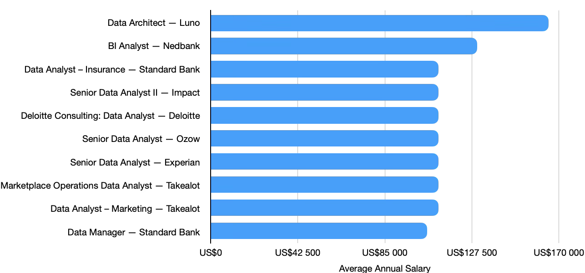

# Introduction
Take a dive into the data job market, focusing on analyst roles in South Africa or remote working roles. This project explores top-paying jobs, in-demand skills and where high demand meets high salaries in data analytics. 

SQL queries? Check them out here: [project_sql folder](/project_sql/)

# Background
This project navigates the analyst job market, pin-pointing top-paying and in-demand skills, aimed at streamlining the search for which skills to develop for analyst jobs primarily in the South African market. 

Data hails from Luke Barousse's [SQL Course](https://www.lukebarousse.com/sql). It has insights on job titles, salaries, locations, and core skills. 

### The questions I wanted to answer through my SQL queries were:

1. What are the top-paying analyst jobs in South Africa and what industries are these jobs in?

2. What skills are required for these top-paying jobs?

3. What are the most in-demand skills for analysts in the South African job market?

4. What skills are associated with higher salaries in South Africa?

5. What are the optimal skills to learn as an aspiring analyst in the South African job market?

# Tools I Used
For this deep dive into the analyst job market, I used several key tools:

- SQL: Forms the backbone of my analysis, allowing me to query the database and unearth key insights.
- PostgreSQL: The chosen database management system, ideal for handling the job posting data.
- Visual Studio Code: My programme of choice for database management and executing SQL queries. 
- Git & GitHub: Essential tools for version control and sharing my SQL scripts and analysis, ensuring collaboration and project tracking. 
- OpenAI's ChatGPT and Google Gemini: Used to interpret data and summarise query data. 

# The Analysis
### 1. Top Paying Analyst Jobs
To identify the highest-paying analyst roles, I filtered the analyst positions by average annual salary and location, focusing on jobs in South Africa. This query highlights the high-paying opportunities in the analyst field. 

```sql
SELECT 
    job_id,
    job_title,
    job_location,
    job_schedule_type,
    salary_year_avg,
    job_posted_date,
    c.name AS company_name
FROM job_postings_fact AS j
    LEFT JOIN company_dim AS c ON j.company_id = c.company_id
WHERE 
    job_title_short ILIKE '%Analyst%' AND
    job_location ILIKE '%South Africa%' AND
    salary_year_avg IS NOT NULL
ORDER BY 
    salary_year_avg DESC;
``` 



*Bar graph visualising the salaries of the top paying analyst roles in South Africa*

Insights into the top paying analyst jobs in South Africa:

1. Data Architecture offers the highest annual salary. The Data Architect role at Luno leads the results at $165,000/year, showing the premium placed on advanced data expertise.

2. Specialised and senior analyst roles dominate the highest-earning brackets while entry-level analyst positions in the same sector lag behind in earnings. BI Analysts and Senior Data Analysts are among the higest earners, suggesting that seniority and specialisation significantly increase earnings. 

3. Financial services is a strong sector for analysts as Standard Bank features prominently among the highest-paying roles, highlighting banking as an attractive industry for data professionals.

4. Johannesburg has strong high-paying opportunities — Several of the highest-paying positions are based in Johannesburg, particularly in banking, data management and senior analytics.

### 2. Top Paying Analyst Job Skills
To find the skills associated with the highest-paying analyst roles, I found which skills appeared in the top 10 analyst positions by average annual salary for jobs in South Africa. This query highlights the skills needed for the most lucrative analyst roles.

``` sql
    WITH top_paying_jobs AS (
    SELECT job_id,
        name AS company_name,
        job_title,
        job_location,
        salary_year_avg
    FROM job_postings_fact AS j
        LEFT JOIN company_dim AS c ON j.company_id = c.company_id
    WHERE job_title_short ILIKE '%Analyst%' AND 
        job_location ILIKE '%South Africa%' AND
        salary_year_avg IS NOT NULL
    ORDER BY salary_year_avg DESC
    LIMIT 10
)
SELECT tpj.*,
    skills
FROM top_paying_jobs AS tpj
    INNER JOIN skills_job_dim AS sjd ON tpj.job_id = sjd.job_id
    INNER JOIN skills_dim AS s ON sjd.skill_id = s.skill_id
ORDER BY 
    salary_year_avg DESC;
```

Table showing the skills required for the 10 top paying analyst jobs in South Africa by looking at the skill count in job listings.

| Skill Name | Skill Count |
| :--- | :---: |
| **SQL** | 8 |
| **Python** | 4 |
| **Power BI** | 4 |
| **Looker** | 3 |
| **Excel** | 3 |
| **Hadoop** | 3 |
| **Tableau** | 3 |
| **AWS** | 2 |
| **Databricks** | 2 |
| **Spark** | 2 |
| **Kafka** | 2 |
| **Flow** | 2 |
| **NoSQL** | 2 |
| **Cassandra** | 2 |

Insights into the top paying analyst skills in South Africa:

1. **SQL** is the most consistently valuable skill, appearing twice as often as the next closest skill. It appears across Nedbank, Impact, Ozow, Deloitte, Takealot, Standard Bank and Experian, making it the strongest common technical foundation.

2. High-paying roles increasingly require a combination of analytics and advanced data technologies. **Python, NoSQL, Spark, Databricks, Hadoop, Kafka** and cloud platforms such as **AWS** appear across the highest-paid positions.

3. BI and visualisation skills remain important even at senior levels. **Power BI, Tableau and Looker** feature in several senior analyst roles, showing that the ability to turn data into business insights remains highly valued.

4. The highest-paying role requires data-engineering expertise. Luno's Data Architect position requires **Databricks, AWS and Spark**, highlighting the substantial earning potential of combining analytics with cloud and big-data technologies.

5. The strongest career skill combination is broad rather than relying on one tool. The data suggests that an analyst targeting the top end of the market should build a core of **SQL + Python + BI**, then add cloud/data-engineering technologies such as **AWS/Azure, Spark and Databricks** to progress toward senior and architect-level roles.

### 3. Top Demand Skills for Analyst Positions
To find the most in-demand analyst skills, I sorted the job postings by the frequency of skill mentions, focusing on jobs in South Africa. This query highlights the top 10 most sought after skills to have as an analyst in South Africa.

``` sql
SELECT 
    skills,
    COUNT(sjd.job_id) AS demand_count
FROM job_postings_fact AS j
INNER JOIN skills_job_dim AS sjd ON j.job_id = sjd.job_id
INNER JOIN skills_dim AS s ON sjd.skill_id = s.skill_id
WHERE
    job_title_short ILIKE '%Analyst%' AND
    job_location ILIKE '%South Africa%'
GROUP BY 
    skills
ORDER BY 
    demand_count DESC
LIMIT 10;
```

Table showing the top 10 skills by demand count for analysts in South Africa.

| Skills | Demand Count |
| :--- | :---: |
| **SQL** | 1,828 |
| **Excel** | 1,122 |
| **Python** | 834 |
| **Power BI** | 765 |
| **SAS** | 644 |
| **R** | 562 |
| **Tableau** | 435 |
| **Azure** | 297 |
| **SAP** | 276 |
| **AWS** | 263 |

Insights into the most in-demand analyst skills in South Africa:

1. **SQL** is by far the most in-demand analyst skill, appearing in 1,828 postings. This makes SQL the strongest foundational skill for an analyst career.

2. **Excel** remains highly relevant, despite the growth of modern analytics tools traditional spreadsheet skills continue to be heavily requested by employers.

3. **Python and Power BI** form a strong second tier. Python appears in 834 postings, while Power BI appears in 765, highlighting the importance of both programming and business intelligence skills.

4. **SAS and R** remain significant, with 644 and 562 postings, respectively. Their relatively high demand suggests that statistical programming remains particularly valuable in industries such as finance, insurance and research.

5. Cloud skills, primarily **Azure and AWS** are emerging, but are less widespread. Having lower demand than core analytics tools, their presence in this list indicates that cloud skills can provide an advantage as analysts move toward more advanced data and analytics roles.

### 4. Top Paying Analyst Skills
To identify the highest-paying skills and companies for analyst roles, I filtered the analyst positions by average annual salary and location, focusing on jobs in South Africa. This query highlights the specific skills tied to high-paying opportunities at various companies in the analyst field.

``` sql
SELECT 
    skills,
    ROUND(AVG(salary_year_avg),0) AS avg_salary,
    c.name AS company_name,
    j.job_title_short AS job_title
FROM job_postings_fact AS j
INNER JOIN skills_job_dim AS sjd ON j.job_id = sjd.job_id
INNER JOIN skills_dim AS s ON sjd.skill_id = s.skill_id
INNER JOIN company_dim AS c ON j.company_id = c.company_id
WHERE 
    job_title_short ILIKE '%Analyst%' AND
    salary_year_avg IS NOT NULL AND 
    job_location ILIKE '%South Africa%'
GROUP BY 
    skills, c.name, j.job_title_short
ORDER BY 
    avg_salary DESC;
```

Table showing the top 10 skills by salary for analysts in South Africa.

| Skill | Average Salary (USD/year) |
| :--- | :---: |
| **Databricks** | $124,892 |
| **Spark** | $111,994 |
| **SQL Server** | $111,175 |
| **T-SQL** | $111,175 |
| **AWS** | $106,883 |
| **BigQuery** | $104,892 |
| **GCP** | $104,838 |
| **PySpark** | $104,838 |
| **Kafka** | $98,530 |
| **Looker** | $96,775 |

Insights into what skills top earning analysts are expected to have:

1. **SQL** is the most consistently required skill in high-paying analyst roles, appearing in 13 postings across 10 companies. Despite it being a key skill for broad employability, it only has an average salary of about $87,000, leaving it short of the list of the top 10 most lucrative data skills. **Python** appears in 6 postings across 5 companies, making it a strong complement to **SQL**. Positions requiring **Python** skills typically have salaries around $92,000, making the **SQL + Python** combination useful for career progression beyond basic reporting and analysis.

2. Skills in advanced data technologies like **Databricks, Spark and AWS** command higher salaries. This suggests that combining analytics skills with data engineering and cloud technology skills can increase earning potential. 

3. BI Skills provide a balance between demand and salary, **Looker** has an average salary of $96,775 which is higher than that of **Power BI** of $90,117, despite Power BI appearing in more job postings. BI skills prove valuable for analysts focused on business intelligence.

4. Specialised skills have a lower demand but come with higher salaries. The data suggests that a strong career path would be to build a high-demand foundation **(SQL, Python, Power BI)** then to specialise in cloud / data engineering technologies **(AWS, Spark, Databricks)**, to target higher-paying roles. 

### 5. Optimal Skills for Analysts
To find the optimal demand and earning intersection for South African analysts, I filtered the skills by job count and an average annual salary above $60,000, again focusing on jobs in South Africa. The query highlights the most valuable and employable skills to have in the analyst field.

``` sql
SELECT
    s.skill_id,
    s.skills AS skill_name,
    COUNT(sjd.job_id) AS demand_count,
    ROUND(AVG(j.salary_year_avg),0) AS avg_salary
FROM
    job_postings_fact AS j
INNER JOIN skills_job_dim AS sjd ON j.job_id = sjd.job_id
INNER JOIN skills_dim AS s ON sjd.skill_id = s.skill_id
WHERE
    job_title_short ILIKE '%Analyst%' AND
    job_location ILIKE '%South Africa%' AND
    salary_year_avg IS NOT NULL
GROUP BY
    s.skill_id, s.skills
HAVING
    ROUND(AVG(j.salary_year_avg),0) > 60000
ORDER BY 
    demand_count DESC,
    avg_salary DESC;
```

Table showing the top 10 optimal skills by demand and salary for Analysts in South Africa.

| Skill Name | Demand Count | Average Salary (USD) |
| :--- | :---: | :---: |
| **SQL** | 25 | $82,482 |
| **Python** | 11 | $91,679 |
| **Power BI** | 10 | $84,568 |
| **Excel** | 9 | $83,025 |
| **Looker** | 7 | $96,775 |
| **Tableau** | 7 | $93,142 |
| **AWS** | 6 | $100,665 |
| **Hadoop** | 6 | $94,721 |
| **SAS** | 6 | $70,940 |
| **Kafka** | 5 | $98,530 |

Here are some insights into the data:

1. __SQL is the strongest foundational skill__. It has by far the highest demand (25 postings), although its average salary of $82,482 is below the dataset median. This makes SQL the best skill for job-market access, rather than salary maximisation alone.

2. __Python__ offers a stronger salary-demand balance. With 11 postings and an average salary of $91,679, Python combines substantial demand with better earning potential than SQL.

3. __AWS, Looker and Tableau__ are particularly attractive specialist skills. AWS averages $100,665, Looker $96,775, and Tableau $93,142, while each appears in 6–7 postings. These provide a better combination of salary and reasonable demand.

4. __Databricks and Spark__ have the highest strategic value. Databricks averages $124,892 and Spark $111,994, despite appearing in only 3 and 4 postings respectively. Their lower demand means they shouldn't replace SQL/Python as foundational skills, but they could be excellent advanced skills for increasing earning potential.

5. The optimal learning strategy is a combination rather than a single skill. Based on this dataset, the strongest pathway is:
__SQL → Python → Power BI → AWS → Spark/Databricks__.
This combines the high demand of core analyst skills with the higher salaries associated with cloud and data-engineering technologies.

# What I Learned
Throughout this journey, I've added SQL to my analytics toolkit, mainly through:

- 🧱 **Query Building:** Through this project I learned the basics of SQL and some advanced SQL, merging tables and using WITH statements to produce temp tables for more insightful data.

- 📊 **Data Aggregation:** Got comfortable with using GROUP BY together with AVG() and COUNT() functions to summarise data.

- 💭 **Analytical Thinking:** Improved my real-world problem solving abilities by turning real-world questions into actionable and insightful SQL queries.

# Conclusions

### Insights

1. The highest-paying analyst roles are reserved for Senior BI or Data Analysts, especially in the financial services sector. The majority of the top-paying analyst jobs are localised to the greater Johannesburg area and are mainly full-time positions. 

2. Almost all analyst positions require SQL proficiency. Senior roles typically require experience with BI tools (**Power BI, Tableau**), while the top-paying roles require analysts to have experience with cloud (**AWS/Azure**) or big-data tools (**Spark/Databricks**) in their arsenals.

3. **SQL + Excel + Python** are the most in-demand skills for analysts. In the South African market, **Power BI** is the BI tool of choice to learn while **AWS and Azure** skills are desirable skills to have for analysts looking to climb the ranks within the industry.

4. Complex data skills, namely **Databricks, Spark & AWS** command higher salaries, suggesting that analysts with core analytics skills coupled with cloud technology experience are more likely to have increased earning potential within the industry. 

5. **SQL** is the strongest foundational skill. However, analysts are required to also have programming (**Python**) and BI (**Power BI**) skills as part of their arsenals. To progress into top-paying roles, analysts need expertise with cloud (**AWS/Azure**) and data engineering (**Databricks/Spark**) tools as well.
